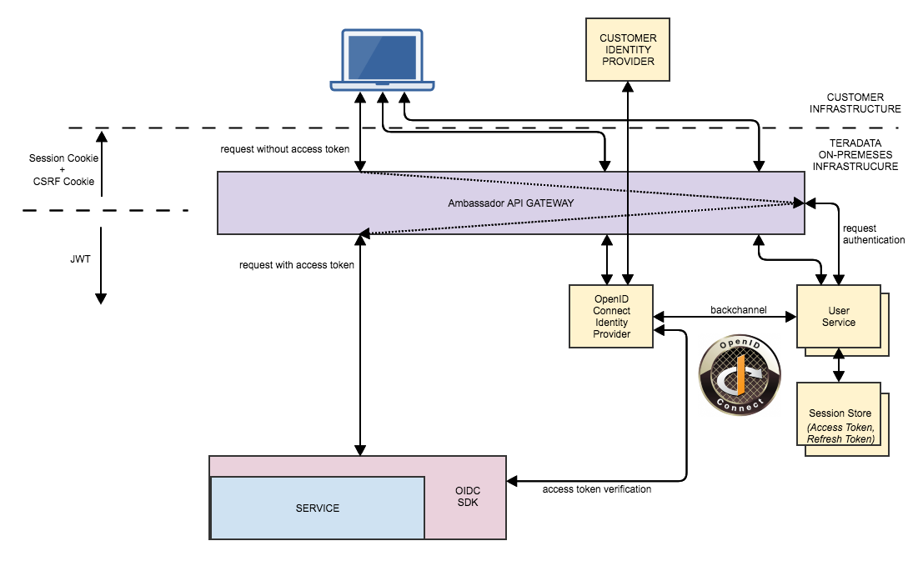

## SSO Information

### Architecture

* SSO in Vantage is provided by Vantage Services and the API Gateway
* The Specification used is the OpenID Connect Authorization Code Flow
* There are two ways to integrate with SSO
  * Integrate following the flow detailed here:
    * Specification: https://openid.net/specs/openid-connect-core-1_0.html#CodeFlowAuth
  * Utilize the `@vantage/ui-platform` module in your Angular/Covalent application
    * Utilizes the API Gateway and Vantage User Service to handle the OpenID Connect flow
    * No Tokens are stored in the browser (better security)
    * Handles CSRF checking
    * Easy integration



----

### Usage

1. Update proxy.conf.js file to include the `VantageLoginProxyConfig` from `@vantage/ui-platform` and replace the `serverUrl` with Vantage Base URL:

e.g.

```js
const vantageLoginProxyConfig = require('@vantage/ui-platform/auth/config/vantageLoginProxyConfig');

/* * * * * * * * * * * */
/* Edit these variables to point to your */
/* Vantage and local development environments */
/* * * * * * * * * * * */

const serverUrl = 'https://vantage.url.io'; // REPLACE WITH VANTAGE BASE URL
const localUrl = "localhost:4200";
const localProto = "http"; // http or https

/* * * * * * * * * * * */
/* This section contains the routes proxied through */
/* your local development environment and the Vantage deployment */
/* * * * * * * * * * * */

const PROXY_CONFIG = {
  ...vantageLoginProxyConfig({ serverUrl, localUrl, localProto }),
  '/api': {
    target: serverUrl,
    secure: false,
    changeOrigin: true,
  },
};

module.exports = PROXY_CONFIG;
```

2. Import required dependencies in app.module.ts or desired NgModule.
    
```ts
  import { VantageAuthenticationModule, VantageAuthenticationInterceptor } from '@vantage/ui-platform/auth';
  import { VantageUserModule } from '@vantage/ui-platform/user';
```

3. Below the last import statement in the same app.module.ts file, declare interceptor providers

```ts
const httpInterceptorProviders: Type<IHttpInterceptor>[] = [
  VantageAuthenticationInterceptor,
];
```

4. Provide modules, interceptors, and services in app.module.ts to NgModule
    
```ts
@NgModule({
  declarations: [],
  imports: [
    //Import Modules
    VantageUserModule,
    VantageAuthenticationModule,

    //Declare interceptor
    CovalentHttpModule.forRoot({
      interceptors: [{
        interceptor: VantageAuthenticationInterceptor, paths: ['**'],
      }],
    }),

  ],
  providers: [
    // Declare service providers
    httpInterceptorProviders,
  ],
```

5. Protect your routes in app.routes.ts with TdAuthenticationModule
    
```ts
import { VantageAuthenticationGuard } from '@vantage/ui-platform/auth';

const routes: Routes = [
    // In root path provide guard to canActivate
    {
        path: '',
        component: MyComponent,
        canActivate: [VantageAuthenticationGuard],
        children: [
            ...
        ],
    },
    { path: '**', redirectTo: '/' },
];
```
